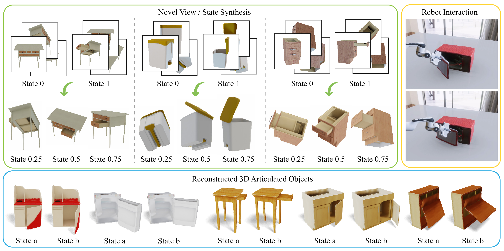

# LARM: A <u>L</u>arge <u>A</u>rticulated-Object <u>R</u>econstruction <u>M</u>odel
(SIGGRAPH ASIA 2025)

[Sylvia Yuan](https://sylviayuan-sy.github.io/), [Ruoxi Shi](https://rshi.top/), [Xinyue Wei](https://sarahweiii.github.io/), [Xiaoshuai Zhang](https://jetd.one/), [Hao Su](https://cseweb.ucsd.edu/~haosu/), [Minghua Liu](https://cseweb.ucsd.edu/~mil070/)

\[[Project Website](https://sylviayuan-sy.github.io/larm-site/) | [arXiv Paper](https://arxiv.org/abs/0000.00000)\]



## Table of Contents

- [Environment Setup](#environment-setup) — Conda-based setup instructions 
- [Pretrained Model](#pretrained-model) — Download and use pretrained checkpoints 
- [Inference Usage](#inference-usage) — Run inference  
- [Post-Inference Tasks](#post-inference-tasks) — Mesh reconstruction, joint estimation, etc.  
- [Evaluation Metrics](#evaluation-metrics) — Chamfer, F-score, LPIPS, PSNR, CLIP  
- [Multi-link Inference](#multi-link-inference) — Combining masks for multi-joint articulation  
- [Data Rendering and Processing (Blender)](#data-rendering-and-processing-blender) — Dataset rendering with Blender  
- [Custom Data Inference](#custom-data-inference) — Run LARM on your own RGB + Camera Information inputs  
- [Training Instructions](#training-instructions) — Distributed training setup and launch  
- [Citation](#citation) — How to cite LARM

## Environment Setup

To set up the development environment for LARM using Conda, follow these steps:

```bash
cd LARM
conda env create -f environment.yaml
conda activate larm
```

This environment includes all necessary dependencies for training, inference, and visualization.

---

## Pretrained Model

A pretrained LARM model checkpoint is available for download [(Google Drive)](https://drive.google.com/file/d/1VcEQIwHQ174lAq22n4HshQme5lY21nOR/view?usp=drive_link).

Please download the checkpoint to `weight/larm/`.

- Pretrained on objaverse dataset.
- Trained on: partnet-mobility dataset ("StorageFurniture", "Microwave", "Refrigerator", "Safe", "TrashCan", "Table").
- Trained on 512x512 rendered images, with 6 input images (3 state=0 images, 3 state=1 images).

---

## Inference Usage


### Download Pretrained Model and Sample Data.

Download the pretrained model as instructed in the previous section. 

Download and unzip the sample data to `data_sample`. There are three data samples. 

**Download sample data here**: [Sample Data](https://drive.google.com/file/d/1b1X9nMZiwhYd3CRNl47t7_NZOfDT374U/view?usp=drive_link)

**View sample output here**: [Sample Output](https://drive.google.com/drive/folders/1j3Lnl3KvvkgcAKM1rVn0_YWNlsDBclxT?usp=drive_link)

### Three Modes
LARM inference runner with three mutually exclusive modes:

  - random   : Sample random target extrinsics and render for a provided qpos list (required for mesh reconstruction).
  - video    : Render a ring of target views and stitch them into an MP4
  - view     : Target views — render one image per provided target pose across all qpos

When using different model versions, note that when using the *rotation augmented* model, apply the flag *--rot-aug*, and use the corresponding *rotation augmented sample data*. When using the *original* model, simply run without the flag and run the *data_sample* folder. 

```bash
# Random mode 
python inference/inference.py --random \
  --model_ckpt weight/larm/model_198000.pth \
  --datalist_path data_sample/random_metadata/data.txt \
  --save_dir output_random \
  --resolution 512 --batch_size 4 --num_input_views 6 \
  --num_target_views 32 \
  --qpos_list "0.00,0.25,0.50,0.75,1.00" \
  --qpos_in_a 0.00 --qpos_in_b 1.00

# Video mode
python inference/inference.py --video \
  --model_ckpt weight/larm/model_198000.pth \
  --datalist_path data_sample/random_metadata/data.txt \
  --save_dir output_video \
  --resolution 512 --batch_size 4 --num_input_views 6 \
  --num_target_views 128 --fps 25

# View mode
python inference/inference.py --view \
  --model_ckpt weight/larm/model_198000.pth \
  --datalist_path data_sample/view_metadata/data.txt \
  --save_dir output_view \
  --resolution 512 --batch_size 4 --num_input_views 6 \
  --qpos_in_a 0.00 --qpos_in_b 1.00
```

### Input Requirements

Each input sample must include:
  - Camera intrinsics and pose information (from `.json` files) for input images.
  - Three input images of the object at state 0.
  - Three input images of the object at state 1.
  - A datalist text file listing all target object directories to be evaluated.

### K-Means Sampling

- If **more than 3 views per state** are provided, we use **K-Means clustering** to cluster all camera poses into 3 clusters and select the **cluster centers**. This ensures diverse viewpoints that are more likely to capture different regions of the object.
- If **exactly 3 views per state** are given, all three are used directly without K-Means.

### Output Structure

For each object and target configuration, the following files will be saved:

```
output_dir/
└── eval_{obj_id}_joint_{joint_idx}/
    ├── transforms.json
    └── images/
        ├── {idx}_{qpos}.png
        ├── {idx}_{qpos}_depth.npy
        ├── {idx}_{qpos}_mask.png
        └── {idx}_{qpos}_partmask.png
```

---

## Post-Inference Tasks

After running `inference/inference.py`, LARM supports several downstream applications. Each task is located in a separate folder with its own README for detailed instructions.

### Joint Estimation

Given articulation types (prismatic or revolute), estimate joint parameters, axis orientations. Located in the `axis_est` directory.

Detailed usage and configuration are described in `axis_est/README.md`.

### Mesh Reconstruction

Located in the `mesh` directory.

- Reconstruct 3D meshes from model outputs.
- Combine segmented parts into full articulated objects.
- Export or visualize reconstructed meshes.

Please refer to the `mesh/README.md` file for step-by-step guidance.

---

## Evaluation Metrics

Located in the `metrics` directory.

- Evaluate the model using the following metrics:
  - Chamfer Distance
  - F-Score
  - LPIPS
  - NVS/Mesh Rendering PSNR
  - CLIP Score

```bash
# image metric
python metrics/eval.py --image --psnr/clip/lpips \
  --datalist_path /path/to/data.txt \
  --category_json /path/to/train_test_split.json \
  --render_dir /path/to/render_dir \
  --load_dir /path/to/output_dir \
  --categories ALL

# mesh metric, to get ground truth mesh for metrics computation, see data_proc/get_gt_mesh.py
python mesh/urdf_to_mesh.py \
  --mode sap/tsdf \
  --load_dir /path/to/output_dir \
  --output_dir /path/to/mesh_dir \
  --qpos_list 0.00,0.25,0.50,0.75,1.00
python metrics/eval.py --mesh --cd/fscore \
  --datalist_path /path/to/data.txt \
  --category_json /path/to/train_test_split.json \
  --load_dir /path/to/output_dir \
  --pred_mesh_root_main /path/to/mesh_dir \
  --gt_mesh_root /path/to/gtmesh_dir \
  --joint_info_json /path/to/joint_info.json \
  --categories ALL

# joint metric
python metrics/eval.py --joint \
  --datalist_path /path/to/data.txt \
  --category_json /path/to/train_test_split.json \
  --load_dir /path/to/output_dir \
  --joint_info_json /path/to/joint_info.json \
  --categories ALL
```

---

## Batch Evaluation Script
To run batch evaluation, follow `scripts/batch_eval.sh`.

---

## Multi-link Inference
LARM supports multilink inference by applying single joint inference process on each joint in an object, then combining the resulting partmask into a joint sum_partmask, and using it in mesh reconstruction as one would any single joint base. Then, combine the seperately reconstructed parts with the base. 

**Download here**: [Multi-link Sample Data](https://drive.google.com/file/d/1viS1pQZY6R87w2srXJ4nbIunkZrtIANM/view?usp=drive_link)

```bash
python inference/inference.py --multilink \
  --model_ckpt weight/larm/model_198000.pth \
  --datalist_path data_sample_multilink/random_metadata/data.txt \
  --save_dir output_multilink
python mesh/combine_mask.py --load_dir=output_multilink --qpos_list=0.00,0.25,0.50,0.75,1.00
```

Note for custom data, all joints for a multilink object should be in the data.txt file.
Then run joint estimation (refer to `README.md` file in `maxis_est/`) and mesh reconstruction as usual, with `mesh/tsdf.py` or `mesh/SAP` (refer to `README.md` file in `mesh/`), followed by:

```bash
python utils/combine_urdf.py  --mode sap/tsdf --load_dir output_multilink --datalist data_sample_multilink/random_metadata/data.txt
```

The output folder is going to be structured as follows
```
output_multilink/
└── sap_urdf_final/ (only if using sap for reconstruction)
    └── eval_{obj_id}_joint_{min_joint_id}/
        ├── mobility_multilink.urdf
        ├── eval_{obj_id}_joint_{joint_idx}_part.ply
        ├── ...
        ├── eval_{obj_id}_joint_{joint_idx}_part.ply
        └── eval_{obj_id}_joint_{joint_idx}_multilink_base.ply
```

---

## Data Rendering and Processing (Blender)

Located in the `data_proc` directory.

- Perform Blender-based rendering of datasets.
- Preprocess raw data into training-ready formats.
- Control camera angles, materials, and lighting for realistic outputs.

See `data_proc/README.md` for Blender pipeline setup and asset preparation.

---

## Custom Data Inference

LARM supports inference on custom RGB data for articulated objects. To prepare your dataset for inference, structure it as follows:

### 📁 Folder Structure

Each object or sequence should reside in a single directory containing:

- RGB images named: `color_{qpos}_in_{idx}.png`  
  - `qpos` denotes the joint position (e.g., 0.00 and 1.00)
  - `idx` is the frame index  
  - Example: `color_0.00_in_001.png`, `color_1.00_in_001.png`

- Metadata files named: `meta_0.00.json` and `meta_1.00.json`  
  - One JSON file per `qpos` value
  - Each file contains camera parameters and transformation data

### Metadata Format (`meta_*.json`)

```json
{
  "resolution": <int>,
  "sample_0": {
    "intrinsics": [
      [fx, 0, cx],
      [0, fy, cy],
      [0, 0, 1]
    ],
    "input_frame_idx": {
      "radius": <float>,
      "transform_matrix": [
        [x11, x12, x13, x14],
        [x21, x22, x23, x24],
        [x31, x32, x33, x34],
        [0.0,  0.0,  0.0,  1.0]
      ],
    }
  }
}
```

- `resolution`: Image resolution (square assumed)
- `intrinsics`: 3x3 camera intrinsics matrix
- `transform_matrix`: 4x4 pose matrix in **Blender coordinate convention**
- `input_frame_idx`: Frame-specific pose:
  - Pose (`transform_matrix`)

### Building Inference Input

Sample meta files for inference input are present in the data_sample folder. The following script collects required information from a data render folder if processed with data_proc. Otherwise, construct required input data json before running the inference script.
```bash
python inference/make_input_from_render.py --in-dir=/path/to/input_dir --out-json=/path/to/target_json --mode=random/view
```

Once your data is formatted correctly, construct a txt file of inference data folder list, pass the path to the inference script. 

For extended instructions on rendering from custom 3D asset data, refer to the `data_proc` folder.

---

## Training Instructions

Training the LARM model can be performed in a distributed multi-node, multi-GPU setup using PyTorch's `torchrun`. The training behavior is controlled via a YAML configuration file.

### Training Data Format

Follow the instructions in `data_proc` for blender rendering. 
Sample training data can be downloaded and viewed from: 
**Download here**: [Sample Training Data (Google Drive)](https://drive.google.com/file/d/13N_bH1q2wJ2BHVe_Y_q5Atl0oY-fgb7W/view?usp=drive_link)

### Configuration

The main training config file is:
```bash
configs/part.yaml
```

### Launch Training (Distributed, Multi-Node)

To run training across nodes with multiple GPUs each:

```bash
NCCL_DEBUG=INFO torchrun --nproc_per_node=num_gpus --nnodes=num_nodes \
  --master-port ${MASTER_PORT} \
  --master-addr ${MASTER_ADDR} \
  --node-rank ${JOB_COMPLETION_INDEX} \
  trainer_mask.py \
  --config=configs/part.yaml
```

---

## Citation

```
@article{yuan2025larmlargearticulatedobjectreconstruction,
      title={LARM: A Large Articulated-Object Reconstruction Model}, 
      author={Yuan, Sylvia and Shi, Ruoxi and Wei, Xinyue and Zhang, Xiaoshuai and Su, Hao and Liu, Minghua},
      journal={arXiv preprint arXiv:2511.11563},
      year={2025},
}
```

